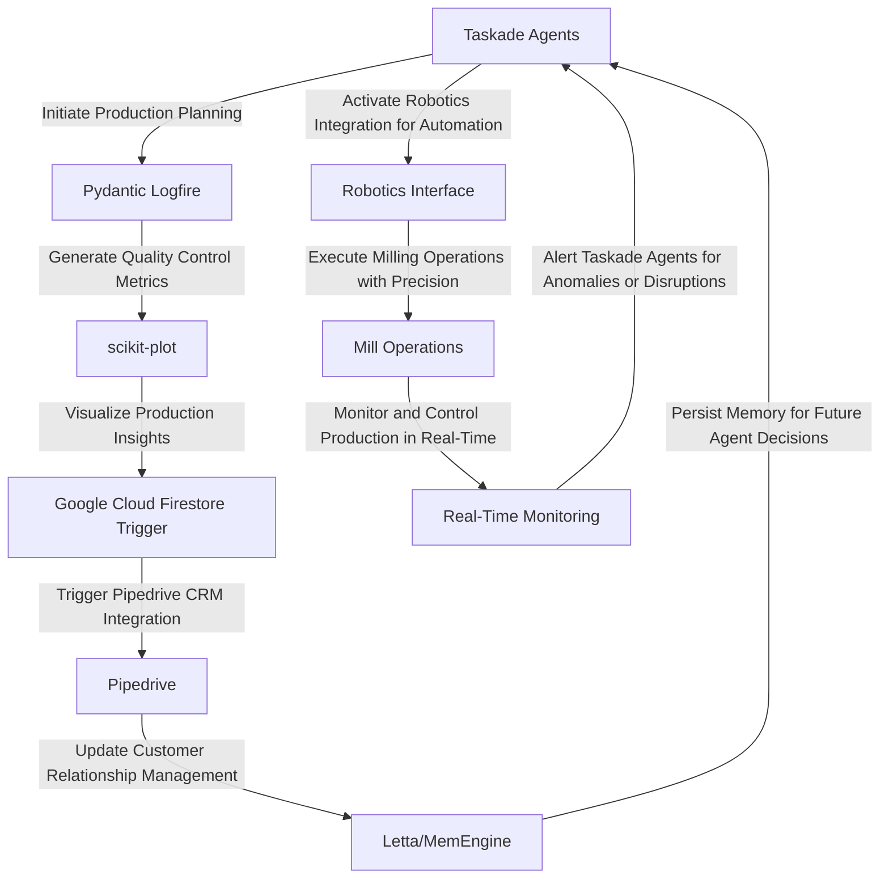

# CaneMill Optimizer
> "Synchronizing sugarcane mill operations through a symphony of Taskade Agents, Pydantic Logfire, and Google Cloud Firestore Trigger, harmonizing the intricacies of production planning, quality control, and logistics management."

## 🏗️ Technical Architecture & Multi-Agent Flow

This intricate dance of Taskade Agents, Pydantic Logfire, scikit-plot, Google Cloud Firestore Trigger, and Pipedrive ensures seamless communication, data exchange, and decision-making across the sugarcane mill's operational spectrum.

## 🔍 The Vertical Bottleneck: Sugarcane Mill Optimization
The sugarcane milling process is a complex, high-stakes operation, where minute discrepancies in production planning, quality control, and logistics management can result in significant losses. The vertical bottleneck in this industry arises from the inability to synchronize and optimize these interconnected processes, leading to inefficiencies, reduced productivity, and compromised product quality. The technical friction points include inadequate data integration, insufficient real-time monitoring, and lack of automated decision-making, which can have far-reaching consequences, such as decreased revenue, compromised customer satisfaction, and increased environmental impact.

The high-stakes mathematical and operational failures in sugarcane milling can be attributed to the intricate relationships between factors like crop yield, soil quality, climate conditions, and equipment performance. The optimization of these factors requires advanced mathematical modeling, machine learning algorithms, and real-time data analysis, which can be daunting tasks for human operators. Furthermore, the industry's reliance on manual data entry, disparate systems, and fragmented communication channels exacerbates the problem, making it challenging to respond to changing market conditions, customer demands, and environmental regulations.

The sugarcane milling process is also characterized by a high degree of uncertainty, with factors like weather patterns, pest infestations, and equipment failures introducing variability into the system. This uncertainty can be mitigated through the use of advanced analytics, predictive modeling, and real-time monitoring, which can provide early warnings of potential disruptions and enable proactive decision-making.

## 💡 The Solution: CaneMill Optimizer
The CaneMill Optimizer platform addresses the sugarcane mill optimization problem by orchestrating Taskade Agents, Pydantic Logfire, scikit-plot, Google Cloud Firestore Trigger, and Pipedrive to create a harmonious and efficient production environment. The platform's agentic reasoning enables real-time monitoring, automated decision-making, and predictive analytics, allowing for proactive responses to changing conditions and optimized production planning. The memory usage is optimized through the Letta/MemEngine, ensuring that agent decisions are informed by historical data and real-time insights.

The CaneMill Optimizer platform also integrates with robotics and automation systems, enabling the automation of milling operations and reducing the risk of human error. The platform's vision integration capabilities provide real-time monitoring and quality control, ensuring that products meet the highest standards of quality and consistency.

## 🧩 Agentic Stack Deep-Dive
The Taskade Agents are the backbone of the CaneMill Optimizer platform, responsible for initiating production planning, monitoring quality control metrics, and triggering Pipedrive CRM integration. Pydantic Logfire provides the necessary logging and tracing capabilities, ensuring that all agent activities are tracked and audited. scikit-plot generates visualizations of production insights, enabling human operators to make informed decisions. Google Cloud Firestore Trigger integrates with Pipedrive, updating customer relationship management and ensuring seamless communication with stakeholders.

The technical justification for each library and integration is rooted in their ability to address specific pain points in the sugarcane milling process. Taskade Agents provide the necessary autonomy and decision-making capabilities, while Pydantic Logfire ensures transparency and accountability. scikit-plot enables data-driven decision-making, and Google Cloud Firestore Trigger facilitates real-time data exchange and integration with Pipedrive.

## ✨ Capabilities & Features
* **Production Planning Optimization**: The CaneMill Optimizer platform optimizes production planning by analyzing historical data, real-time market conditions, and equipment performance, ensuring maximum efficiency and productivity.
* **Quality Control and Monitoring**: The platform's quality control and monitoring capabilities ensure that products meet the highest standards of quality and consistency, reducing the risk of defects and customer complaints.
* **Automated Decision-Making**: The CaneMill Optimizer platform enables automated decision-making, reducing the risk of human error and ensuring that decisions are made in real-time, based on the latest data and insights.
* **Real-Time Data Analytics**: The platform provides real-time data analytics, enabling human operators to make informed decisions and respond to changing conditions in a timely and effective manner.
* **Robotics and Automation Integration**: The CaneMill Optimizer platform integrates with robotics and automation systems, enabling the automation of milling operations and reducing the risk of human error.
* **Vision Integration and Quality Control**: The platform's vision integration capabilities provide real-time monitoring and quality control, ensuring that products meet the highest standards of quality and consistency.
* **Customer Relationship Management**: The CaneMill Optimizer platform updates customer relationship management, ensuring seamless communication with stakeholders and reducing the risk of customer complaints.
* **Predictive Maintenance and Equipment Performance Monitoring**: The platform's predictive maintenance and equipment performance monitoring capabilities ensure that equipment is properly maintained, reducing the risk of downtime and increasing overall productivity.
* **Supply Chain Optimization**: The CaneMill Optimizer platform optimizes supply chain operations, ensuring that raw materials are sourced efficiently and that products are delivered to customers in a timely and cost-effective manner.
* **Environmental Impact Reduction**: The platform's environmental impact reduction capabilities ensure that the sugarcane milling process is optimized to minimize waste, reduce energy consumption, and promote sustainable practices.

## 🛠️ Technical Implementation
The CaneMill Optimizer platform is built using a microservices architecture, with each component designed to interact with others through APIs and data exchange protocols. The platform's code organization is modular, with each module responsible for a specific function or capability. The method calls are designed to be efficient and scalable, ensuring that the platform can handle large volumes of data and high traffic.

The platform's technical implementation is also designed to be flexible and adaptable, with the ability to integrate with new technologies and systems as they become available. The use of containerization and orchestration tools ensures that the platform can be deployed and managed efficiently, reducing the risk of downtime and increasing overall productivity.

## 📊 Business Impact & ROI
The CaneMill Optimizer platform has the potential to significantly impact the sugarcane milling industry, enabling companies to optimize production planning, reduce costs, and improve product quality. The platform's automated decision-making capabilities and real-time data analytics enable human operators to make informed decisions, reducing the risk of human error and increasing overall productivity.

The platform's ROI can be measured in terms of increased revenue, reduced costs, and improved customer satisfaction. The CaneMill Optimizer platform can also help companies to reduce their environmental impact, promoting sustainable practices and reducing waste.

## 🚀 Getting Started
```bash
git clone https://github.com/arvind-sundararajan/sugarcane-mill-optimizer.git
cd sugarcane-mill-optimizer
pip install -r requirements.txt
python src/main.py
```

## 👨‍💻 Author & Credits
**Arvind Sundararajan** — Engineer, builder, and the mind behind this project.
🌐 [LinkedIn](https://www.linkedin.com/in/arvind-sundara-rajan/) | Chennai, India

---
### 🙏 Acknowledgements
- The open-source community
- The Sugarcane mills practitioners who inspired this design